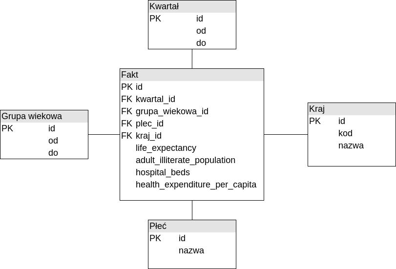

# Gwiazda

# Pytania
1. Jak zmieniała się w czasie średnia długość życia w rozróżnieniu na płeć w poszczególnych krajach?
2. W których krajach i których kwartałach była największa dysproporcja pomiędzy kobietami, a mężczyznami?
3. W którch krajach społeczeństwo najardziej się starzeje ?
4. Czy jest korelacja ilości łóżek oraz nakładów na służbę zdrowia do długości życia ? Jeśli tak to w których krajach?
5. W których kwartałach w każdym kraju był największy spadek ludności ? (np wojny)
6. W których krajach jest najwięcej nastolatków (z podziałem na płeć) ?
7. Ile jest na świecie analfabetów (z podziałem na lata) ?
8. Czy jest korelacja ilości analfabetów (procentowo) do długości życia ?
9. Kraje z najlepszym bilansem długość życia/wydatki na opiekę zdrowotną
10. Kraje z najgorszym bilansem długość życia/wydatki na opiekę zdrowotną
11. Lista krajów ze stosunkiem liczby ludności do nakładów na służbę zdrowia

# Dane (dla każdego kraju, od 1960 do 2015)
* `Gender_StatsData.csv` (grupa wiekowa wyliczna)
  * Life expectancy at birth, male (years) - `SP.DYN.LE00.MA.IN`
  * Life expectancy at birth, female (years) - `SP.DYN.LE00.FE.IN`
* `EdStatsData.csv` - wyniki rzadkie - w niektórych latach.
  * Adult illiterate population, 15+ years, female (number) - `UIS.LP.AG15T99.F`
  * Adult illiterate population, 15+ years, male (number)	- `UIS.LP.AG15T99.M`
* `HNP_StatsData.csv`
  * Female population 00-04 - `SP.POP.0004.FE`
  * Female population 05-09	-`SP.POP.0509.FE`
  * Female population 10-14	- `SP.POP.1014.FE`
  * Female population 15-19	- `SP.POP.1519.FE`
  * Female population 20-24	- `SP.POP.2024.FE`
  * Female population 25-29	- `SP.POP.2529.FE`
  * Female population 30-34	- `SP.POP.3034.FE`
  * Female population 35-39	- `SP.POP.3539.FE`
  * Female population 40-44	- `SP.POP.4044.FE`
  * Female population 45-49	- `SP.POP.4549.FE`
  * Female population 50-54	- `SP.POP.5054.FE`
  * Female population 55-59	- `SP.POP.5559.FE`
  * Female population 60-64	- `SP.POP.6064.FE`
  * Female population 65-69	- `SP.POP.6569.FE`
  * Female population 70-74	- `SP.POP.7074.FE`
  * Female population 75-79	- `SP.POP.7579.FE`
  * Female population 80+	- `SP.POP.80UP.FE`
  * Male population 00-04	- `SP.POP.0004.MA`
  * Male population 05-09	- `SP.POP.0509.MA`
  * Male population 10-14	- `SP.POP.1014.MA`
  * Male population 15-19	- `SP.POP.1519.MA`
  * Male population 20-24	- `SP.POP.2024.MA`
  * Male population 25-29	- `SP.POP.2529.MA`
  * Male population 30-34	- `SP.POP.3034.MA`
  * Male population 35-39	- `SP.POP.3539.MA`
  * Male population 40-44	- `SP.POP.4044.MA`
  * Male population 45-49	- `SP.POP.4549.MA`
  * Male population 50-54	- `SP.POP.5054.MA`
  * Male population 55-59	- `SP.POP.5559.MA`
  * Male population 60-64	- `SP.POP.6064.MA`
  * Male population 65-69	- `SP.POP.6569.MA`
  * Male population 70-74	- `SP.POP.7074.MA`
  * Male population 75-79	- `SP.POP.7579.MA`
  * Male population 80+	- `SP.POP.80UP.MA`
  
  * Hospital beds (per 1,000 people)	- `SH.MED.BEDS.ZS` (dane rzadkie)
  * Health expenditure per capita (current US$)	 - `SH.XPD.PCAP`

